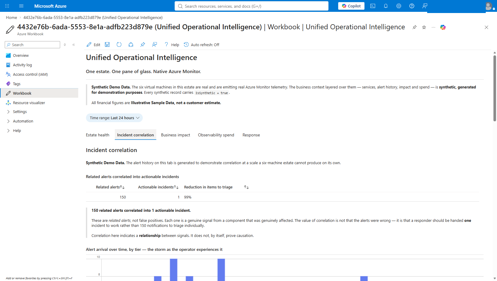

# Unified Operational Intelligence

An Azure executive demonstration: a unified operational intelligence layer over a
simulated hybrid insurance estate, built entirely on native Azure Monitor.

**The Azure Portal is the demonstration surface.** There is no custom web
application to run, deploy or maintain. Everything an audience sees is a native
Azure experience — workbooks, dashboards, VM Insights, Alerts, Logs and Azure
Automation — rendering data from a live estate.

---

## Why a health plan should care

> *It is 02:14. Claims Intake is degraded.*
>
> *The infrastructure team sees CPU saturation on two hosts. The APM tool is
> paging on latency. The log platform has fired on error rate. The synthetic
> monitor says the member portal is failing its transaction. Four tools, four
> on-call engineers, four different truths — and `150` alerts in the queue.*
>
> *Nobody in the bridge call can answer the only question the Chief Operating
> Officer asks twenty minutes later: **how many members are affected, and which
> business services are down?***

That gap — between abundant telemetry and a business answer — is what this
demonstration addresses. Not by adding a sixth tool, but by correlating what
Azure Monitor already collects.

The estate is modelled as an insurer's core administration stack: **Policy
Administration, Claims Intake, Quote Engine, Billing and Payments** and
**Document Archive**. For a payer those are not analogies, they are the actual
systems — the claims pipeline, the member billing run, the enrolment and
document flows that a health plan is measured on. The demonstration deliberately
does **not** model clinical systems; there is no EHR, no PACS, no patient data
and no PHI anywhere in it.

### What the demonstration shows

| Question a health plan asks | What the demo answers | Where |
| --- | --- | --- |
| "Why does one event page four teams?" | **150 related alerts correlated into 1 actionable incident** — a 99% reduction in what a human has to triage. | Incident correlation tab |
| "Who is actually affected?" | **11,098 affected users** — members, in payer terms — and **$78,206 per hour** of revenue exposed at the incident's peak, broken out by business service. | Business impact tab |
| "What are we paying to learn this?" | **$107,950 a month** across five tools, of which roughly **$28,800 a month — about $346,000 a year** is the same telemetry ingested more than once. | Observability spend tab |
| "Can it fix itself?" | No — and deliberately so. Remediation is **proposed**, a human approves, and the approval is written to an audit trail. | Response tab |

> All figures above are **Illustrative Sample Data, not a customer estimate.**
> They are invented to be plausible for a mid-size insurer and are not derived
> from any customer's actuals. See [`docs/business-case.md`](docs/business-case.md)
> for how each is calculated and an explicit list of what is *not* claimed.



*The Incident correlation tab. The synthetic-data banner is visible at the top of
every tab; it is never hidden from the audience.*

### Why this lands with a regulated buyer

Three things matter to a health plan that do not always matter elsewhere:

- **Auditability.** The correlation is deterministic KQL, not a model. Every
  number on screen can be traced to the query that produced it, and the query
  can be read aloud. Nothing asks the audience to trust a black box.
- **Human accountability.** Nothing remediates itself. The approval gate is a
  demonstrated control, not a roadmap item — which is the conversation a risk
  or compliance officer will want to have.
- **No new attack surface.** No agent to install beyond the Azure Monitor Agent
  already present, no data leaving the tenant, no third-party SaaS in the path,
  and no credentials anywhere — every action is authorised by Entra ID and
  managed identity.

The honest caveat, stated up front: this demonstrates **correlation, not
causation**, over a synthetic business layer on a real estate. It is an
architecture and a workflow made tangible — not a migration estimate, and not a
vendor comparison.

---

## What is real and what is synthetic

State this plainly when presenting. It is a credibility asset, not a disclaimer.

| Layer | Status |
| --- | --- |
| Six virtual machines | **Real.** Ubuntu, running in `rg-uoi-iaas`. |
| CPU / memory / disk / network / Syslog / Heartbeat | **Real.** Collected by Azure Monitor Agent. |
| Alert rules, fired alerts, action group | **Real Azure Monitor resources.** |
| Workbook, dashboard, Automation runbook | **Real Azure resources.** |
| Business services, incidents, revenue, tool spend | **Synthetic.** Labelled `IsSynthetic = true`, ingested through a real Data Collection Rule. |

Every generated record carries `IsSynthetic` and `DataClassification`. All
generated content is **Synthetic Demo Data.** All financial figures are
**Illustrative Sample Data, not a customer estimate.** No customer data, no
production telemetry, no real third-party monitoring tenant and no real
on-premises infrastructure is involved at any point.

---

## Repository layout

```
infra-iaas/
  main.bicep              Subscription-scope entry point; creates rg-uoi-iaas
  modules/                Network, monitoring, VMs, DCRs, custom tables,
                          alerts, workbook, dashboard, automation
  workbooks/              The five-tab workbook (the primary demo surface)
  scripts/
    seed-estate.py        Synthetic business-layer generator
    validate-workbook.ps1 Executes every embedded workbook query
    Invoke-ApprovedRemediation.ps1
    reset-estate.ps1
docs/
  business-case.md        The argument, the numbers, what is not claimed
  demo-azure-portal.md    Click-by-click presenter guide  <- start here
  requirements-spec.md    Original contract (largely superseded; see ADR 0004)
  adr/                    Architecture decision records
  UOI-Azure-Portal-Demo-Walkthrough.docx
                          The same walkthrough as a Word document, with
                          14 redacted portal screenshots
tools/
  docgen/                 Generates the Word walkthrough. See its README
                          before re-capturing screenshots.
```

---

## Deploying

Requires an Azure subscription and an SSH public key. No secret is stored
anywhere in this repository.

```powershell
az deployment sub create `
  --location eastus2 `
  --subscription <subscription-id> `
  --template-file infra-iaas/main.bicep `
  --parameters adminPublicKey="$(Get-Content ~/.ssh/uoi-iaas-demo.pub -Raw)"
```

Then seed the synthetic business layer by running `infra-iaas/scripts/seed-estate.py`
on one of the VMs. It authenticates with the VM's managed identity through IMDS,
so there is no credential to supply or store.

Validate before presenting:

```powershell
.\infra-iaas\scripts\validate-workbook.ps1 -SubscriptionId <subscription-id>
```

This executes all 17 KQL queries embedded in the workbook against the live
workspace. ARM validates the workbook JSON but never the KQL inside it, so this
is the only check that catches a broken tile before an audience does.

---

## Presenting

See **[`docs/demo-azure-portal.md`](docs/demo-azure-portal.md)** for the full
click-by-click guide, and **[`docs/business-case.md`](docs/business-case.md)**
for the argument being made, the illustrative numbers behind it and an explicit
list of what the demonstration does *not* claim. The same walkthrough is
available as a Word document with screenshots at
[`docs/UOI-Azure-Portal-Demo-Walkthrough.docx`](docs/UOI-Azure-Portal-Demo-Walkthrough.docx),
rebuildable via [`tools/docgen`](tools/docgen/README.md). In short:

1. **Dashboard `dash-uoi`** — opening frame.
2. **Workbook** — five tabs. The headline: **150 related alerts correlated into
   1 actionable incident.**
3. **Native drill-down** — VM Insights, fired Alerts, ad-hoc KQL in Logs, DCRs.
4. **Automation runbook** — the human approval gate, run live: refuse first,
   then approve. Both outcomes are audited.

---

## Narrative discipline

These constraints are binding and survive the change of architecture:

- Say **"150 related alerts correlated into 1 actionable incident."** Never call
  them false positives — each was a true signal about the same condition.
- **Correlation does not prove causation.** It collapses triage volume and points
  a responder at the earliest related signal. Causation remains a human judgement.
- **No autonomous remediation.** A human approval decision is required, and both
  approvals and refusals are audited.
- Do **not** frame the customer's existing monitoring investment as a mistake.
  The argument is consolidation, not a competitive teardown.
- Label all financials as illustrative and all data as synthetic.

---

## Known limitations

- **VM Insights Map is unavailable.** The Dependency Agent rejects the Ubuntu
  builds in this estate, and the newest published version predates the deployed
  one. VM Insights **Performance** works from the Azure Monitor Agent alone;
  service topology is presented in the workbook instead. See
  `infra-iaas/modules/vms.bicep`.
- **Telemetry latency is roughly 10 minutes** after VMs start, and about the same
  for a newly created custom table's first ingestion. Zero rows immediately after
  a successful upload is latency, not failure. Start the estate at least 20
  minutes before a demonstration.
- **The synthetic business layer ages out.** It is timestamped when seeded and
  spans about 45 minutes; the workbook defaults to a 24-hour window. Re-seed on
  the day you present, or the incident, impact and spend tabs render empty.
- The estate costs **$17.28/day** while running — six `Standard_D2ls_v7` at
  $0.12/hr, or roughly **$548/month** at 24×7 including disks and Log Analytics
  ingestion. **The VMs are normally left deallocated**, which stops compute
  billing while preserving disks, the workspace and all ingested data. A nightly
  auto-shutdown at **23:00 UTC** is configured on every VM as a backstop. Start
  the estate before presenting and allow 5–10 minutes for the monitoring agents
  to reconnect — see §0 of the presenter guide.

---

## History

This repository previously contained a TypeScript monorepo — a React SPA and an
Express API deployed to Azure Container Apps, with 342 tests and five Playwright
journeys — built against `docs/requirements-spec.md`.

On 2026-09-16 the project owner directed a change of approach: the demonstration
was to be rebuilt on Azure IaaS and native Azure Monitor, with the Azure Portal
as the only surface. The application was retired and both of its Azure
deployments were torn down on the same instruction.

The application was **not** retired because of a technical fault. It worked. The
decision was a change of demonstration strategy, and it supersedes the locked
stack in §4 of the requirements specification. That decision is recorded in
**[`docs/adr/0004-supersede-container-apps-with-azure-native.md`](docs/adr/0004-supersede-container-apps-with-azure-native.md)**.

The full application source, its tests and the original ADRs 0001–0003 remain in
the git history at commit `c55ab2a` and can be restored.

## License

See [LICENSE](LICENSE).
